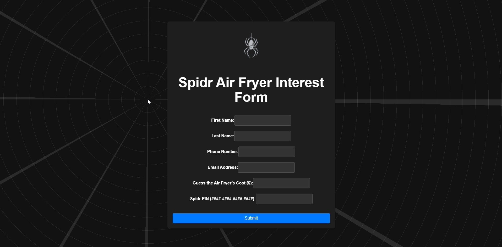

# 🔥 Spidr Air Fryer Interest Form

A single-page interest form built with React and Tailwind CSS. This form is designed to collect details about Spidr Design’s revolutionary air fryer.



> 🕸 Inspired by the design language of [Spidr Design](https://spidr.design/)

---

## 🚀 Live Demo

🌐 [View it live on Vercel](https://spidr-interview.vercel.app/)  

---

## 🧰 Built With

- [React](https://reactjs.org/)
- [Tailwind CSS](https://tailwindcss.com/)
- [Vite](https://vitejs.dev/)

---

## 🛠 Getting Started

Clone the repo and run it locally:

```bash
git clone https://github.com/umutulay/spidr_interview.git
cd spidr_interview
npm install
npm run dev
